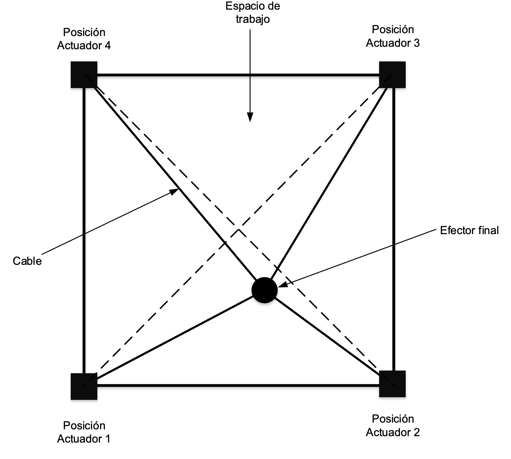

# Trabajo Final - Curso Introductorio a Python
## Movimiento de un robot paralelo accionado por cuatro cables

-  **Nombre:** Xavier Ivan Aguas Haro
-  **email:** xavieraguas03@gmail.com

  
    Los robots accionados por cables son una clase especial de robots paralelos, los cuales están formados al reemplazar los enlaces rígidos por cables. Gracias a las características físicas que otorgan los cables como baja inercia y mayor rango de movimiento en comparación con las articulaciones esféricas, les permite ser excelentes candidatos para realizar una amplia gama de aplicaciones porque poseen ventajas como: manipulación de objetos a alta velocidad, carga útil alta, bajo costo de instalación y mantenimiento.

  
    
    

Consta de 3 elementos importantes:

* Espacio de trabajo o base
* Actuadores o motores
* Efector final

Para realizar este estudio se utilizo los siguientes requerimientos
- Python 3.7
- Pandas *(Latest Version)*
- Numpy *(Latest Version)*

### Objetivo:

Identificar el movimiento del robot accionado por cuatro cables en el plano xy. Dibujar el desempeño en el **eje x** y **eje y**. Además mostrar el error en función del tiempo a través del **índice del error cuadratico**. Realizar el procedimiento anterior para dos figuras. 

## Revisar el archivo con el nombre:  
* [TrabajoFinal_XavierAguas.ipynb](https://github.com/kabirivan/CDRR-Movement/blob/main/TrabajoFinal_XavierAguas.ipynb)  realizado en JUPITER.